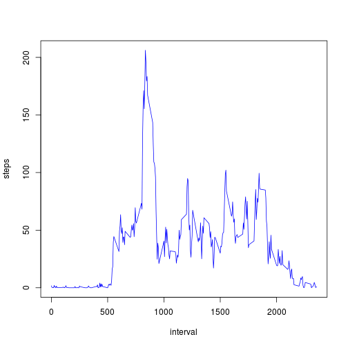
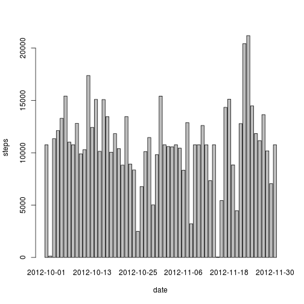

# Loading and preprocessing the data

```r
activity <- read.csv("activity.csv")
```

# Make a histogram of the total number of steps taken each day


```r
steps.date <- aggregate(steps ~ date, data = activity, FUN = sum)
barplot(steps.date$steps, names.arg = steps.date$date, xlab = "date", ylab = "steps")
```

 

# Total number of mean and median 

```r
mean(steps.date$steps)
```

```
## [1] 10766
```

```r
median(steps.date$steps)
```

```
## [1] 10765
```

# Average daily activity pattern

```r
steps.interval <- aggregate(steps ~ interval, data = activity, FUN = mean)
plot(steps.interval, type = "l")
```

 


```r
steps.interval$interval[which.max(steps.interval$steps)]
```

```
## [1] 835
```


# Imputing missing values


```r
sum(is.na(activity))
```

```
## [1] 2304
```


```r
activity <- merge(activity, steps.interval, by = "interval", suffixes = c("", 
    ".y"))
nas <- is.na(activity$steps)
activity$steps[nas] <- activity$steps.y[nas]
activity <- activity[, c(1:3)]
```


```r
steps.date <- aggregate(steps ~ date, data = activity, FUN = sum)
barplot(steps.date$steps, names.arg = steps.date$date, xlab = "date", ylab = "steps")
```

 

```r

mean(steps.date$steps)
```

```
## [1] 10766
```

```r

median(steps.date$steps)
```

```
## [1] 10766
```


# Differences in activity patterns between weekdays and weekends


```r
daytype <- function(date) {
    if (weekdays(as.Date(date)) %in% c("Saturday", "Sunday")) {
        "weekend"
    } else {
        "weekday"
    }
}
activity$daytype <- as.factor(sapply(activity$date, daytype))
```


```r
par(mfrow = c(2, 1))
for (type in c("weekend", "weekday")) {
    steps.type <- aggregate(steps ~ interval, data = activity, subset = activity$daytype == 
        type, FUN = mean)
    plot(steps.type, type = "l", main = type)
}
```

 

